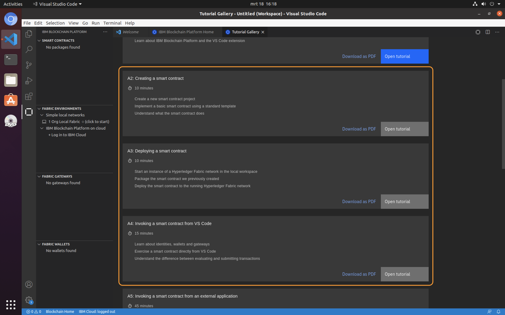

# How blockchain can make a real difference
Imagine every citizen had the confidence that philanthropic commitments to support societal challenges such as extreme poverty were being honored. That resources were in fact filtering down to the people with the greatest needs. That every dollar donated and spent was making a real impact. Wouldn’t a more transparent system motivate people to more readily champion worthy causes? Or better yet, inspire them to donate more themselves?
Complete this pattern to build a simple blockchain network using Hyperledger Fabric, on which cause-specific pledges and fund transfers are made by the government, registered with aid organizations, and validated by Global Citizen.

**Audience level**: Intermediate Developers

## Prerequisites

All necessary prereqs to sucessfully complete this workshop have been put together in a virtual image. A VMware based image and a VirtualBox based image have been prepared. Please select one of the options below to complete the prereqs. 

<details>
  <summary>Using VirtualBox</summary>
  
  1. The [VirtualBox image](https://ibm.biz/hlfabric-1) containing Hyperledger Fabric and all other pre-reqs to complete this workshop.
  
  2. VirtualBox 6.x: [https://www.virtualbox.org/wiki/Downloads](https://www.virtualbox.org/wiki/Downloads)

  Once VirtualBox 6.x is installed on your system, double-click the file `Hyperledger Fabric.ova` and accept all defaults to import it into VirtualBox.

</details>

<details>
  <summary>Using VMware</summary>

  1. The [VMware image](https://ibm.biz/hlfabric-2) containing Hyperledger Fabric and all other pre-reqs to complete this workshop.

  2. VMware player: [https://www.vmware.com/products/workstation-player/workstation-player-evaluation.html](https://www.vmware.com/products/workstation-player/workstation-player-evaluation.html)

Once VMware Player is installed on your system, double-click he file `Hyperledger Fabric.vmx` in the folder `Hyperledger Fabric.vmwarevm` and accept all defaults to import the image into VMware Player.

</details>

or when you prefer not to use a virtual image and wanna set up everything yourself...

<details>
  <summary>Install all prereqs on your own machine</summary>

  1. Follow the steps at the 'Requirements' section of the IBM Blockchain extension for Visual Code at:

  <li>https://github.com/IBM-Blockchain/blockchain-vscode-extension</li>

</details>

#### IBM Cloud Account
All options require an IBM Cloud account, so if you don't already have one, you can create one for free at: https://ibm.biz/Bdz647

## Overview
The image below depicts a high level overview of the tracking donations scenario and will form the basis of our application. The original idea comes from the 'Tracking Donations with blockchain' code pattern and has been modified so that it can be deployed to the IBM Blockchain Platform service.

  

The application to support the above process involves a frontend, a business service and a smart contract. The latter contains the asset `ProjectPledge`, representing the cause-specific pledge, and the following transactions: `createProjectPledge`, `sendPledgeToGlobalCitizen`, `sendPledgeToGovOrg`, `updatePledge` and `transferFunds`. The business service works as middle layer and exposes the REST API. It interacts with the smart contract using the Hyperledger Fabric Node.js SDK. The transaction invoked on the smart contract updates the ledger. All this is depicted in the schematic overview below.

  

As you can see in the image, building this application consists of three major steps. The fourth and last step is to connect the dots and to integrate all parts.

## Steps
1. [Build a frontend in Node-RED](#1-build-a-front-end-in-node-red)
2. [Build the Business Service](#2-build-the-business-service)
3. [Build the Smart Contract](#3-build-the-smart-contract)
4. [Connecting all parts](#4-connecting-all-parts)

## 1. Build a frontend in Node-RED
Logon to IBM Cloud using the free account you just created. Next, enter 'Node' as search argument in the search bar (1). In the search results, select the Node-RED App (2).

  

Click the 'Get Started' button to continue. Next, provide a unique name (1) for your application and make sure the selected region matches the one assigned to your Lite account. Verify the selected plans are Lite plans and click 'Create' (2) to create the application. 


To actually deploy the created application to the cloud, click the 'Deploy your app' button (1).


and select 'Cloud Foundry' as the deployment target. Click 'New' (1) to create a new API key and make sure that the selected region (2) matches the region of your Lite account. Verify that the allocated memory for the application is 256MB and click 'Next' (3).


On the 'Configure the DevOps toolchain' page, select the region (1) again that matches your Lite account and click 'Create' (2) to deploy the application to the cloud.


As the deployment takes a couple of minutes to complete, you might want to move on to [Part 2](#2-build-the-business-service) to create your business service and return later to complete the setup of the frontend service.

Once the deployment successfully completed (1) and the app is awake, click the App URL (2).


Next, complete the Node-RED initial set-up wizard. Click 'Next' on the first screen and choose a userid/password on the second one to secure your Node-RED environment. Click 'Next' (1) and 'Next' again to go to the final overview page of the wizard. Click 'Finish' to complete the wizard. 


On the welcome page click on the **Go to your Node-RED flow editor** button.


Login with your Node-RED credentials (the userid/password you specified in the wizard). You are presented with the drawing canvas, that you'll need to create your Node-RED flows. As we are developing a frontend, we need UI nodes. Unfortunately, these are not present by default so we need to add them. For this, click the menu on the top right (1) and select 'Manage palette' (2).


Next, click 'Install' (1) and type `dashboard` in the search bar (2). In the search results look for `node-red-dashboard` and click 'Install' (3) to start the installation of the Node-RED dashboard nodes. 


Once the installation successfully completes, click 'Close' (4) to close the palette. The dashboard nodes are available to you as a separate section on the left-hand side. You might need to scroll down to see them.


This completes the first section. You just created a Node-RED application on IBM Cloud that will serve as frontend and that is ready to consume some REST services... :+1:

## 2. Build the Business Service

The business service is generated using the so-called LoopBack framework. LoopBack is a highly extensible, open-source Node.js and TypeScript framework based on Express that enables you to quickly create APIs and microservices composed from backend systems such as databases and SOAP or REST services. See the [LoopBack.io](https://loopback.io) site for more information if you want to learn more about this framework.

The application uses two generators, the application generator and the OpenAPI generator. The latter generates the models and controllers that are needed by the business service. The models and controllers are defined in the `openapi.json` file. For the remaining part of this lab, you'll need to start the virtual image. Once the image is completely up and running, open a terminal session (1). 


The first step is to change directory to the `Development/blockchain` folder and to clone the `hlfabric-lab-code` git repository. 

```bash
$ cd ~/Development/blockchain
$ git clone https://github.com/IBMDeveloperBNL/hlfabric-lab-code
```

This will download the necessary code snippets to your virtual image. Next, in the terminal session, make sure the current folder is the `Development/blockchain` folder and type:

```bash
$ lb4 my-bc-app
```

This invokes the application generator, which generates a basic LoopBack application with the name `my-bc-app`. Hit \<Enter\> on all questions to accept the default values. Once the application has been generated, change directory to the `my-bc-app` folder and invoke the OpenAPI generator to complete the set-up of your business service.

```bash
$ cd ~/Development/blockchain/my-bc-app
$ lb4 openapi --url ../hlfabric-lab-code/business-service/openapi.json --validate true
```

Again, hit \<Enter\> to accept the defaults. The `lb4` command with the `openapi` option generates the necessary models and controllers as defined in the file `openapi.json`. Browse to the `business-service` subfolder of `hlfabric-lab-code` to manually inspect the JSON file. You'll see definitions for the `ProjectPledge` asset as well as for transactions like `createProjectPledge` and `transferFunds`.

Finally, the skeleton for the business service can be tested by typing `npm start` (current directory should be `my-bc-app`).

```bash
$ cd ~/Development/blockchain/my-bc-app
$ npm start
```

Now open a browser session and browse to [http://localhost:3000/explorer](http://localhost:3000/explorer). This gives an overview of all available REST endpoints of our business service. 

Try to invoke one of the endpoints, e.g. `/CreateProjectPledge`, by clicking on the service (1). Next, click 'Try it out' (2) and provide some sample values (3). Finally, click 'Execute' (4) to submit the request and to test the service. 


The response will be a '500 Internal Server Error'. This is by design....:smiley: 
The current implementation of the service throws exactly this error message.

```ts
export class CreateProjectPledgeController {
  constructor() { }

  /**
   *
   *
   * @param _requestBody
   * @returns ResponseMessage model instance
   */
  @operation('post', '/CreateProjectPledge', {
    'x-controller-name': 'CreateProjectPledgeController',
    'x-operation-name': 'createProjectPledgeCreate',
    tags: [
      'CreateProjectPledgeController',
    ],
    responses: {
      '200': {
        description: 'ResponseMessage model instance',
        content: {
          'application/json': {
            schema: {
              $ref: '#/components/schemas/ResponseMessage',
            },
          },
        },
      },
    },
    requestBody: {
      content: {
        'application/json': {
          schema: {
            $ref: '#/components/schemas/CreateProjectPledge',
          },
        },
      },
    },
    operationId: 'CreateProjectPledgeController.createProjectPledgeCreate',
  })
  async createProjectPledgeCreate(@requestBody({
    content: {
      'application/json': {
        schema: {
          $ref: '#/components/schemas/CreateProjectPledge',
        },
      },
    },
  }) _requestBody: CreateProjectPledge): Promise<ResponseMessage> {
    throw new Error('Not implemented');
  }
}
```

It is our job to implement the business service in a meaningful way. This is done in [Part 4](#4-connecting-all-parts) of this pattern, but first we have to develop the smart contract.

## 3. Build the Smart Contract

Typically, business rules that need to be executed --- before a transaction can be recorded on the blockchain --- are captured in a so-called smart contract, also referred to as chaincode in Hyperledger Fabric. As this is an important part of our application, it is good to get familiar with the basics of smart contract development in Hyperledger Fabric. 

For this, we will follow three of the basic tutorials that are part of the IBM Blockchain extension in Visual Code. After you completed these tutorials you should have a better understanding of how to develop and debug smart contracts, as well as of how to deploy them to your local HyperLedger Fabric network. The IBM blockchain extension itself is built to provide developers an integrated workflow for building blockchain applictions. 

To get started with these tutorials, click on the Visual Code launcher (1) in your virtual image.


Next, click the IBM Blockchain extension on the left-hand side (1), followed by the blockchain icon on the top right (2). This opens the IBM Blockchain Platform welcome page. On this page, click the 'Tutorials' tile (3) to open the tutorials gallery. 


Next, complete the tutorials A2, A3 and A4. These tutorials take you through the basics of smart contract development for Fabric and really help you to better understand the rest of this section.



At this point, you should have completed the tutorials and gained some basic knowledge on smart contract development. The next step is to build the smart contract for the tracking donations use case. For this, open a terminal session and change directory to the `smart-contract` folder in the `hlfabric-lab-code` repo and run the following commands.

```bash
$ cd ~/Development/blockchain/hlfabric-lab-code/smart-contract
$ npm install
```

Next, add the `smart-contract` folder to your workspace in Visual Code. Your workspace should look similar to:


Now, inspect this smart contract project. The structure of it is similar to the one from the tutorial. In this case, there are 2 assets and 5 transactions. The transactions are defined and implemented in the file `src/my-projectpledge-contract.ts`. Take a look at the `createProjectPledge` transaction.

```ts
@Transaction()
async createProjectPledge(ctx: Context, aidOrg: string, pledgeNumber: string, name: string, description: string, fundsRequired: number): Promise<void> {
    const pledgeId: string = aidOrg + ':' + pledgeNumber;
    const exists: boolean = await this.projectPledgeExists(ctx, pledgeId);

    if (exists) {
        throw new Error(`The project pledge ${pledgeId} already exists`);
    }

    // create an instance of the project pledge
    let pledge: ProjectPledge = new ProjectPledge();

    pledge.pledgeNumber = pledgeNumber;
    pledge.aidOrg = aidOrg;
    pledge.name = name;
    pledge.description = description;
    pledge.fundsRequired = fundsRequired;
    pledge.status = ppState.INITIALSTATE;

    const buffer: Buffer = Buffer.from(JSON.stringify(pledge));
    await ctx.stub.putState(pledgeId, buffer);

    // define and set pledgeEvent
    let pledgeEvent = {
        type: "Create ProjectPledge",
        pledgeId: pledgeId,
        name: pledge.name,
        description: pledge.description,
        fundsRequired: pledge.fundsRequired,
        status: pledge.status,
    };

    await ctx.stub.setEvent('PledgeEvent', Buffer.from(JSON.stringify(pledgeEvent)));        
}
```

The `@Transaction()` method decorator is used to indicate that the function actually transacts on the blockchain. Functions that are only reading from the ledger have the decorator `@Transaction(false)`. Inside the function is checked whether a project pledge with the given pledgeId already exists. If not, a new project pledge asset is created based on the values from the input parameters. Next, the project pledge is converted to a buffer and submitted to the blockchain by calling `ctx.stub.putState`. Finally, a `pledgeEvent` object is created and an event is emitted to notify its listeners about the created project pledge. Now, have a close look at the other functions in `src/my-projectpledge-contract.ts` so that you understand the different transactions involved. 

The above transactions are always related to a given project pledge -- the asset. So, in our contract we have one main asset -- which is defined in `src/projectpledge.ts` -- and a supporting funding asset (`src/funding.ts`). Have a close look at both files. You'll see that they are both decorated with the `@Object()` method decorator and that they define the attributes (properties) of the asset.

```ts
/*
 * SPDX-License-Identifier: Apache-2.0
 */

import { Object, Property } from 'fabric-contract-api';

@Object()
export class Funding {
    /**
     *
     */
    @Property()
    fundingType: 'WEEKLY' | 'MONTHLY' | 'SEMIANNUALY' | 'ANNUALY';
  
    /**
     *
     */
    @Property()
    nextFundingDueInDays: number;

    :
    :

```

The last part of this section is to deploy the smart contract to our blockchain network. For this, open the IBM Blockchain extension in your Visual Code editor by clicking the blockchain icon on the left-hand side (1). Next, in the Smart Contracts panel, select the Options (2) and click 'Package Open Project' (3).


Next, make sure to select the 'V2 channel capabilities' from the drop-down (1).


This results in a `global-citizen@0.0.1` package in the 'Smart Contracts' palette. Next, make sure your local fabric is started by checking the 'Fabric Environments' palette. If you see the message '1 Org Local Fabric (click to start)', click that message to start your local blockchain network. 

Once the network is started, click 'mychannel' followed by 'Deploy smart contract' (1). 


At Step 1 of the deployment process, select the packaged version of `global-citizen@0.0.1` (1) from the drop-down and click Next (2). 


The next step of the deployment wizard allows you to create a smart contract definition. For this workshop we keep all settings default. Click 'Next' (1) to continue.


and click 'Deploy' to start the deployment of the smart contract to the blockchain network.


The final step in this section is to test whether the smart contract has been successfully deployed. For this, click on the 'Org1 Gateway' in the 'Fabric Gateways' panel and expand 'mychannel -> global-citizen@0.0.1'. Now, click the createProjectPledge (1) method. This opens the Transaction View. 


Make sure the transaction arguments (1) are as follows:

```json
{
  "aidOrg": "aid1",
  "pledgeNumber": "001",
  "name": "test",
  "description": "test desc",
  "fundsRequired": "100000"
}
```

and click 'Submit transaction' (2). The transaction should complete successfully. See the Transaction Output section for details. Finally, test whether you can read the new project pledge by evaluating the `readProjectPledge` function. For this, select the 'readProjectPledge' function from the transaction drop-down (1). Pass `["aid1:001"]` as pledgeId (2) and click (3) to evaluate the transaction. Verify is your response matches the transaction output (4) in the screenshot below.


## 4. Connecting all parts

### Connect the Business Service to the smart contract

The business service communicates with the smart contract via the Hyperledger Fabric Node.js SDK. We concentrated all communication with the blockchain network in the file `blockchainClient.ts`. To include this file in your project, copy it from the `hlfabric-lab-code` repo to the `src` folder of your business service.

```bash
$ cd ~/Development/blockchain
$ cp ./hlfabric-lab-code/business-service/src/blockchainClient.ts ./my-bc-app/src
```

Next, move the `local_fabric` folder from the `hlfabric-lab-code` repo to the root folder of your business service. This folder contains the connection information to your local Hyperledger Fabric network, as well as some JavaScript files to enroll an admin user and a normal user.

```bash
$ cd ~/Development/blockchain
$ mv ./hlfabric-lab-code/business-service/local_fabric ./my-bc-app
```

Now open the `blockchainClient.ts` file in Visual Code. An important function in this class is the function `connectToNetwork()`.

```ts
async connectToNetwork() {
  try {
    // A wallet stores a collection of identities for use
    const wallet: Wallet = await Wallets.newFileSystemWallet('./local_fabric/wallet');

    await gateway.connect(ccp, {wallet, identity: appAdmin, discovery: gatewayDiscovery});

    // Connect to our local fabric
    const network: Network = await gateway.getNetwork('mychannel');

    console.log('**********************************************************************************************************');
    console.log('--> connecting to channel: ' + CHANNEL);

    // Get the contract we have installed on the peer
    const contract: Contract = network.getContract(CONTRACT);

    const listener: ContractListener = async (event: ContractEvent) => {
      if (event.eventName === 'PledgeEvent') {
        if (event.payload) {
          const eventPayload = JSON.parse(event.payload.toString('utf8'));
          const eventTransaction: TransactionEvent = event.getTransactionEvent();
          const eventBlock: BlockEvent = eventTransaction.getBlockEvent();

          // Output the PledgeEvent
          console.log('\n--> ******** received pledge event ********');
          console.log(`-->    type: ${eventPayload.type}`);
          console.log(`-->    pledgeId: ${eventPayload.pledgeId}`);
          console.log(`-->    name: ${eventPayload.name}`);
          console.log(`-->    description: ${eventPayload.description}`);
          console.log(`-->    fundsRequired: ${eventPayload.fundsRequired}`);

          if (eventPayload.funds) {
            console.log(`-->       fundingType: ${eventPayload.funds.fundingType}`);
            console.log(`-->       approvedFunding: ${eventPayload.funds.approvedFunding}`);
            console.log(`-->       totalFundsReceived: ${eventPayload.funds.totalFundsReceived}`);
            console.log(`-->       fundsPerInstallment: ${eventPayload.funds.fundsPerInstallment}`);
          }

          console.log(`-->    pledge status: ${eventPayload.status}`);
          console.log(`--> `);
          console.log(`-->    block number: ${eventBlock.blockNumber}`);
          console.log(`-->    transaction ID: ${eventTransaction.transactionId}`);
          console.log(`-->    transaction status: ${eventTransaction.status}`);
          console.log('--> ******** processed pledge event ********\n');
        }
      }
    };

    // Define file based checkpointer to keep track of last block and transactions in that block, that have been seen by this client.
    const options: ListenerOptions = {
      checkpointer: await DefaultCheckpointers.file('./checkpoint.json')
    }

    // Add the listener defined above to the contract so that it can receive smart contract events emitted by the chaincode
    await contract.addContractListener(listener, options);

    // Define network object that contains both the contract and the network object
    const networkObj = {
      contract: contract,
      network: network
    };

    return networkObj;
  } catch (error) {
    console.log(`Error processing transaction. ${error}`);
    console.log(error.stack);

    return error;
  }
}
```

Let's discuss what happens here. First, a connection is made to the gateway using the admin identity of the network (see line 33 of the code). Next, an instance of the `mychannel` network is retrieved in line 36 and an instance of the contract is obtained in line 42. Note that in this demo we explicitly look for `global-citizen` as contract name and that this name matches the name of the smart contract that was deployed to the network in [Part 3](#3-build-the-smart-contract) of this pattern. In line 44-74 of the code a contract listener is defined, which allows us to listen to contract events emitted from within the smart contract. At line 82 the contract listener is added to the contract. Note that the event also provides information like block number and the transaction ID. A default file checkpointer is used to keep track of last block, and transactions in that block, that has been seen by this client. Finally, in line 85, the contract and network are stored in the `networkObj` object. This object is specifically created for this purpose and is returned to the caller in line 90 of the code. 

In the client, every transaction has its own function. They all have the same layout. A generic input object `args` is expected with mandatory attributes `contract` and `function`. Last but not least, you need to provide the attributes that the transaction expects. As an example, the `createProjectPledge` function is listed below.

```ts
async createProjectPledge(args: any) {
  // Calling createProjectPledge transaction in the smart contract
  console.log('--> invoking createProjectPledge(ctx, "' + args.aidOrg + '", "' + args.pledgeNumber + '", "' + args.name + '", "' + args.desc + '", "' + args.fundsRequired + '")');
  return await args.contract.submitTransaction(args.function, args.aidOrg, args.pledgeNumber, args.name, args.desc, args.fundsRequired);
}
```

Now all transactions can be invoked via the client, it is time to implement the controller logic. For this, add the `my-bc-app` folder to your workspace in Visual Code and expand the `src/controllers` folder. Double-click the first controller `create-project-pledge.controller.ts` in the list. Now replace line 230

```ts
throw new Error('Not implemented');
```

with the following code:

```ts
    try {
      let networkObj = await blockchainClient.connectToNetwork();

      if (networkObj && !(networkObj.stack)) {
        // Construc the input object with right function to call, the necessary
        // parameters and the created contract from the blockchainClient class
        let inputObj = {
          function: 'createProjectPledge',
          contract: networkObj.contract,
          pledgeNumber: _requestBody.pledgeNumber,
          name: _requestBody.name,
          desc: _requestBody.description,
          fundsRequired: _requestBody.fundsRequired,
          aidOrg: _requestBody.aidOrg
        };

        await blockchainClient.createProjectPledge(inputObj);
      } else {
        // Couldn't connect to network, so passing this object on to catch clause...
        throw new Error(networkObj.message);
      }

      let responseMessage: ResponseMessage = new ResponseMessage({message: 'added project pledge'});
      return responseMessage;

    } catch (error) {
      let responseMessage: ResponseMessage = new ResponseMessage({message: error, statusCode: '400'});
      return responseMessage;
    } finally {
      // Workaround for error @grpc/grpc-js: Closing Stream After Unary Call Triggers Double Free
      // For more info: https://github.com/grpc/grpc-node/issues/1464
      await new Promise(resolve => setTimeout(resolve, 0));

      // Properly disconnecting from the network
      blockchainClient.disconnectFromNetwork();
    }
```

You'll probably notice that the `blockchainClient` variable cannot be resolved. This is because there is no `blockchainClient` defined in the controller. To define one, type the following line of code above the class definition in the controller. By typing this line yourself, the editor will automatically add the import statement to your code when saving your changes.

```ts
let blockchainClient = new BlockChainModule.BlockchainClient();
```

The code should now look similar to:

```ts
import {api, operation, requestBody} from '@loopback/rest';
import {BlockChainModule} from '../blockchainClient';
import {CreateProjectPledge} from '../models/create-project-pledge.model';
import {ResponseMessage} from '../models/response-message.model';

let blockchainClient = new BlockChainModule.BlockchainClient();

/**
 * The controller class is generated from OpenAPI spec with operations tagged
 * by CreateProjectPledgeController.
 *
 */
@api({
  :
  :
})
export class CreateProjectPledgeController {
  constructor() { }
  :
  :
```

and the errors should have disappeared. Make sure your changes to the controller code are saved. Next, repeat these steps for all other controllers in the folder. Below  the code snippets are listed for each of the controllers.

**project-pledge.controller.ts**
```ts
    try {
      let networkObj = await blockchainClient.connectToNetwork();

      if (networkObj && !(networkObj.stack)) {
        // Construc the input object with right function to call, the necessary
        // parameters and the created contract from the blockchainClient class
        let inputObj = {
          function: 'readProjectPledge',
          contract: networkObj.contract,
          id: id
        };

        const response: any = await blockchainClient.queryProject(inputObj);
        return response;
      } else {
        // Couldn't connect to network, so passing this object on to catch clause...
        throw new Error(networkObj.message);
      }
    } catch (error) {
      return error;
    } finally {
      // Workaround for error @grpc/grpc-js: Closing Stream After Unary Call Triggers Double Free
      // For more info: https://github.com/grpc/grpc-node/issues/1464
      await new Promise(resolve => setTimeout(resolve, 0));

      // Properly disconnecting from the network
      blockchainClient.disconnectFromNetwork();
    }
```

**send-pledge-to-global-citizen.controller.ts**
```ts
    try {
      let networkObj = await blockchainClient.connectToNetwork();

      if (networkObj && !(networkObj.stack)) {
        // Construc the input object with right function to call, the necessary
        // parameters and the created contract from the blockchainClient class
        let inputObj = {
          function: 'sendPledgeToGlobalCitizen',
          contract: networkObj.contract,
          pledgeId: _requestBody.pledgeId
        };

        await blockchainClient.sendPledgeToGlobalCitizen(inputObj);
      } else {
        // Couldn't connect to network, so passing this object on to catch clause...
        throw new Error(networkObj.message);
      }

      let responseMessage: ResponseMessage = new ResponseMessage({message: 'Sent project pledge ' + _requestBody.pledgeId + ' to citizen org for review...'});
      return responseMessage;

    } catch (error) {
      let responseMessage: ResponseMessage = new ResponseMessage({message: error, statusCode: '400'});
      return responseMessage;
    } finally {
      // Workaround for error @grpc/grpc-js: Closing Stream After Unary Call Triggers Double Free
      // For more info: https://github.com/grpc/grpc-node/issues/1464
      await new Promise(resolve => setTimeout(resolve, 0));

      // Properly disconnecting from the network
      blockchainClient.disconnectFromNetwork();
    }
```

**send-pledge-to-gov-org.controller.ts**
```ts
    try {
      let networkObj = await blockchainClient.connectToNetwork();

      if (networkObj && !(networkObj.stack)) {
        // Construc the input object with right function to call, the necessary
        // parameters and the created contract from the blockchainClient class
        let inputObj = {
          function: 'sendPledgeToGovOrg',
          contract: networkObj.contract,
          pledgeId: _requestBody.pledgeId
        };

        await blockchainClient.sendPledgeToGovOrg(inputObj);
      } else {
        // Couldn't connect to network, so passing this object on to catch clause...
        throw new Error(networkObj.message);
      }

      let responseMessage: ResponseMessage = new ResponseMessage({message: 'Sent project pledge ' + _requestBody.pledgeId + ' to government org for review...'});
      return responseMessage;

    } catch (error) {
      let responseMessage: ResponseMessage = new ResponseMessage({message: error, statusCode: '400'});
      return responseMessage;
    } finally {
      // Workaround for error @grpc/grpc-js: Closing Stream After Unary Call Triggers Double Free
      // For more info: https://github.com/grpc/grpc-node/issues/1464
      await new Promise(resolve => setTimeout(resolve, 0));

      // Properly disconnecting from the network
      blockchainClient.disconnectFromNetwork();
    }
```

**transfer-funds.controller.ts**
```ts
    try {
      let networkObj = await blockchainClient.connectToNetwork();

      if (networkObj && !(networkObj.stack)) {
        // Construc the input object with right function to call, the necessary
        // parameters and the created contract from the blockchainClient class
        let inputObj = {
          function: 'transferFunds',
          contract: networkObj.contract,
          pledgeId: _requestBody.pledgeId
        };

        await blockchainClient.transferFunds(inputObj);
      } else {
        // Couldn't connect to network, so passing this object on to catch clause...
        throw new Error(networkObj.message);
      }

      let responseMessage: ResponseMessage = new ResponseMessage({message: 'Total funds received incremented for project pledge ' + _requestBody.pledgeId});
      return responseMessage;

    } catch (error) {
      let responseMessage: ResponseMessage = new ResponseMessage({message: error, statusCode: '400'});
      return responseMessage;
    } finally {
      // Workaround for error @grpc/grpc-js: Closing Stream After Unary Call Triggers Double Free
      // For more info: https://github.com/grpc/grpc-node/issues/1464
      await new Promise(resolve => setTimeout(resolve, 0));

      // Properly disconnecting from the network
      blockchainClient.disconnectFromNetwork();
    }
```

**update-pledge.controller.ts**
```ts
    try {
      let networkObj = await blockchainClient.connectToNetwork();

      if (networkObj && !(networkObj.stack)) {
        // Construc the input object with right function to call, the necessary
        // parameters and the created contract from the blockchainClient class
        let inputObj = {
          function: 'updatePledge',
          contract: networkObj.contract,
          pledgeId: _requestBody.pledgeId,
          fundingType: _requestBody.fundingType,
          approvedFunding: _requestBody.approvedFunding,
          fundsPerInstallment: _requestBody.fundsPerInstallment
        };

        await blockchainClient.updatePledge(inputObj);
      } else {
        // Couldn't connect to network, so passing this object on to catch clause...
        throw new Error(networkObj.message);
      }

      let responseMessage: ResponseMessage = new ResponseMessage({message: 'Updated project pledge ' + _requestBody.pledgeId});
      return responseMessage;

    } catch (error) {
      let responseMessage: ResponseMessage = new ResponseMessage({message: error.message, statusCode: '400'});
      return responseMessage;
    } finally {
      // Workaround for error @grpc/grpc-js: Closing Stream After Unary Call Triggers Double Free
      // For more info: https://github.com/grpc/grpc-node/issues/1464
      await new Promise(resolve => setTimeout(resolve, 0));

      // Properly disconnecting from the network
      blockchainClient.disconnectFromNetwork();
    }
```
Now, try to run your business service by running `npm start` from the root directory of your service.

```bash
$ cd ~/Development/blockchain/my-bc-app
$ npm start
```

This will fail with the following error message:


This is because the `blockchainClient` class uses the `fabric-network` module, which is not added as a dependency yet. To fix this error, open the `package.json` file in Visual Code and add the following line to the `devDependencies` section.

```
"fabric-network": "^2.2.0"
```

This adds the module as a dependency. Next, run `npm install` in the same directory as before.

```bash
$ cd ~/Development/blockchain/my-bc-app
$ npm install
```

When the blockchain network was started for the first time (in [Part 3](#3-build-the-smart-contract) of this pattern), an admin user was registered with our Certificate Authority. Now we need to send an enroll call to the CA server and retrieve the enrollment certificate (eCert) for this user. We won’t delve into enrollment details here, but suffice by saying that the SDK --- and by extension our applications --- need this cert in order to form a user object for the admin. This user object (identity) is needed to connect to the Hyperledger Fabric gateway (see line 30 in the `blockchainClient.ts` file). 

To enroll the admin user, type the following in the `local_fabric` folder of your business service.

```bash
$ cd ~/Development/blockchain/my-bc-app/local_fabric
$ npm install
$ node enrollAdmin.js
```

Congratulations!! :+1: 
We can now start to test the connected business service by running `npm start` in the root folder of your project.

```bash
$ cd ~/Development/blockchain/my-bc-app
$ npm start
```

The service can be accessed on [http://localhost:3000/explorer](http://localhost:3000/explorer). Next, test all transactions to make sure the controllers are properly implemented and can access the smart contract.

We start with the CreateProjectPledgeController. Create a new project pledge using the parameters as shown in the screenshot below. Remember...to get to the form where you can provide the project pledge details, first click the `CreateProjectPledgeController`. Then, click the POST request `CreateProjectPledge` and finally the 'Try it out' button on the right. The POST request should return a 'HTTP 200 OK' response message.


Next, send this project pledge to the citizen organization for review by invoking the `SendPledgeToGlobalCitizenController` function. If you used the parameters from the screenshot above, you should use `aid2:002` as identifier (pledgeId) for the project pledge.


Next, send the project pledge to the government organization. Use the same pledgeId as above.


The government organization can update the project pledge with the total funding approved, the funding type and the fund installment per transfer. To update the project pledge with these details, invoke the controller with the following parameters...


Finally, start transferring funds by invoking the `TransferFundsController` controller with `aid2:002` as pledgeId.


Now, query the project pledge by invoking the `ProjectPledgeController` controller. Use the same pledgeId as above. 


You should see an output similar to:


Note the funds object that is part of the project pledge now. If you invoke `transferFunds` again, followed by the above project pledge query, you should see an increase of the `totalFundsReceived` attribute.

### Connecting the business service to the frontend

As the business service exposes the transactions as RESTful endpoints, it is relatively easy to connect the frontend to it. The most important part is to open up the local running business sevice to the outside world. This is done via a tool called `ngrok`, which can be started by typing 

```bash
$ ngrok http 3000
```

in a terminal session in your virtual image. The execution of this command results in a secure tunnel that allows communication (HTTP) from the outside world towards your locahost (i.e. in the virtual image) listening on port 3000.


The result should be similar to:


At this point your running business service should also be accessible via the URL above (1). Try this with your own URL in a browser to verify whether this holds for you as well.

To show that the frontend can connect to the business service, open a new tab in your browser and look up the app URL of the Node-RED application that you deployed in [Part 1](#1-build-a-front-end-in-node-red). Paste this URL in your browser. On the Node-RED welcome page, click the 'Go to your Node-RED editor' button to open your flow editor. Logon with your Node-RED userid / password when prompted. On the empty canvas, we will create a very simple flow that, on request, reads a project pledge with a given pledgeId and then, sends the output to the debug node. 

From the node pallet drag the inject node (1) and the debug node (2) to the canvas. 


Now scroll down in the node pallet till you see the 'network' section and drag the HTTP request node (1) onto the canvas as well. Connect the three nodes together as shown at (2) in the screenshot below. 


Next, double-click the 'http request' node and fill in the URL (1) as shown below. Replace the secure base URL with your secure ngrok URL and click 'Done' (2). Finally, click 'Deploy' (3) to deploy the flow. 


To test the flow, click the small box (1) left from the timestamp inspect node. Click the debug tab on the right to see the result. This should be a string representing the project pledge with pledgeId `aid2:002`.


Congratulations!! :clap: :+1: You successfull integrated the three components of the application!! The frontend (Node-RED) invokes via a REST call the business service. The business service uses the Hyperledger Fabric Node.js SDK to invoke a transaction of the smart contract, which in its turn transacts with the blockchain network.

### Build a basic dashboard to create project pledges
Okay, agreed, this still is a very minimalistic UI...Therefore, let's extend it a bit and create a web UI that can be used to create new project pledges. For this, click the menu (1) on the top-right and select Import (2).


Next, click 'select a file to import' (1) and browse to the `frontend` folder of the `hlfabric-lab-code` repo. Select the file `create-project-pledge.json` and click 'Open'. Next, make sure 'new flow' (2) is selected. This will import the flow as a new flow in a separate tab. Finally, click Import (3) to complete the import.


The result should be similar to:


Double-click on both HTTP request nodes and make sure the base URL (https://<something>.ngrok.io) points to your secure ngrok URL. Finally, click 'Deploy' (1) to deploy the flow. You can now test the dashboard by going to the same base URL as your Node-RED application only suffixed with `/ui` instead of `/red`. So the URL for the dashboard should look like:

```
http://<node-red-base-url>/ui
```

The result should be similar to: 


**CONGRATULATIONS!!** :smiley: :+1: 

You successfully created a blockchain application capable of tracking donations according to the simplified business scenario mentioned at the top of this pattern. Next, play around with the dashboard and create some additional project pledges and query them. Have a look at the 'Blockchain' log in Visual Code to confirm that your dashboard activities actually transact with the blockchain network.

